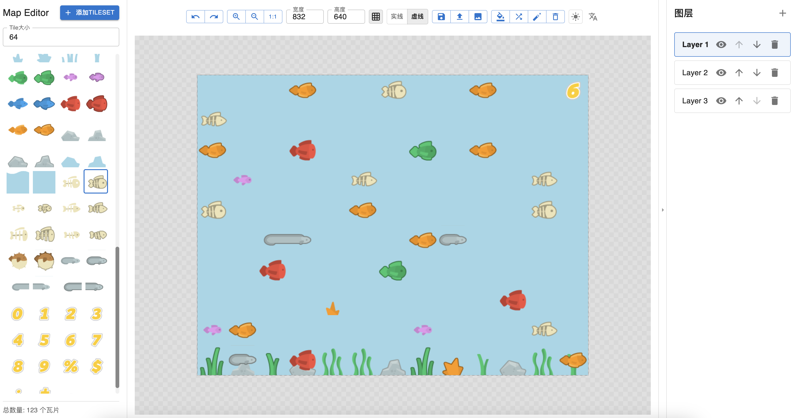

# Map Editor

English | [简体中文](README.md)


A simple yet powerful tile map editor for creating and editing 2D game maps.




## Features

- 🎨 Tileset Management
  - Import images and automatically slice into tiles
  - Custom tile size support
  - Preview and select tiles

- 📝 Layer Operations
  - Multi-layer support
  - Show/hide layers
  - Adjust layer order
  - Clear layer content

- 🎯 Editing Tools
  - Grid assistance (solid/dashed)
  - Zoom and pan
  - Undo/redo
  - Quick fill
  - Random distribution
  - Eraser tool

- 💾 Import/Export
  - Export as PNG image
  - Export as JSON format
  - Import JSON for continued editing

- 🌈 UI Customization
  - Dark/Light theme toggle
  - Chinese/English language switch
  - Responsive layout

## Local Development

### Requirements

- Node.js >= 16
- npm >= 8

### Installation

1. Clone repository
```bash
git clone https://github.com/bruceman/map-editor.git
cd map-editor
```

2. Install dependencies
```bash
npm install
```

3. Start development server
```bash
npm run dev
```

4. Open in browser
```
http://localhost:5173
```

## Technologies

- React 19
- TypeScript
- Material-UI (MUI)
- Konva.js
- Zustand
- Vite
- i18n (Internationalization)

## Development

- Build for production
```bash
npm run build
```

- Code linting
```bash
npm run lint
```

## License

MIT 