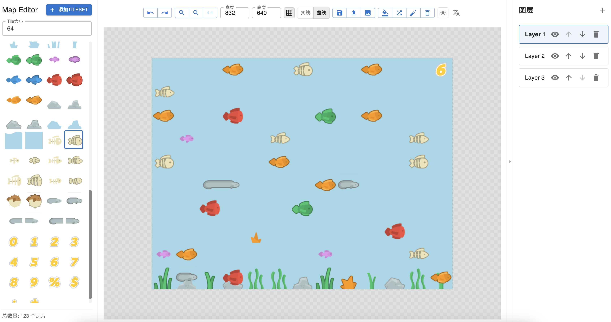

# Map Editor

[English](README-EN.md) | 简体中文


一个简单而强大的瓦片(Tiles)地图编辑器，用于创建和编辑 2D 游戏地图。




## 功能特点

- 🎨 瓦片集管理
  - 导入图片并自动切割瓦片
  - 支持自定义瓦片大小
  - 预览和选择瓦片

- 📝 图层操作
  - 多图层支持
  - 图层显示/隐藏
  - 图层顺序调整
  - 清空图层内容

- 🎯 编辑功能
  - 网格辅助（实线/虚线）
  - 缩放和平移
  - 撤销/重做
  - 一键填充
  - 随机分布
  - 橡皮擦工具

- 💾 导入导出
  - 导出为 PNG 图片
  - 导出为 JSON 格式
  - 导入 JSON 继续编辑

- 🌈 界面定制
  - 深色/浅色主题切换
  - 中文/英文语言切换
  - 响应式布局

## 本地运行

### 环境要求

- Node.js >= 16
- npm >= 8

### 安装步骤

1. 克隆仓库
```bash
git clone https://github.com/bruceman/map-editor.git
cd map-editor
```

2. 安装依赖
```bash
npm install
```

3. 启动开发服务器
```bash
npm run dev
```

4. 打开浏览器访问
```
http://localhost:5173
```

## 使用技术

- React 19
- TypeScript
- Material-UI (MUI)
- Konva.js
- Zustand
- Vite
- i18n (多语言支持)

## 开发

- 构建生产版本
```bash
npm run build
```

- 代码检查
```bash
npm run lint
```

## 许可证

MIT
